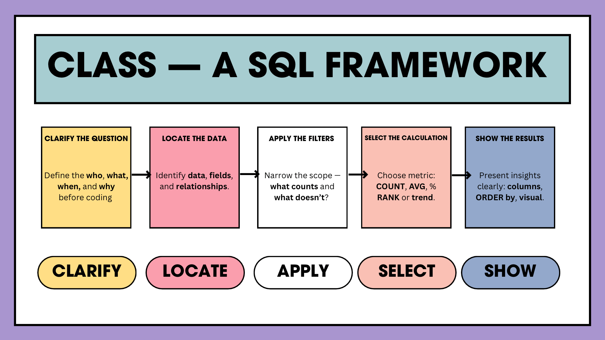

[Home](https://stacynwigwe.github.io/product-experiments/) | 
[🔙 Back to Portfolio](https://stacynwigwe.github.io/portfolio/)
---
# CLASS SQL Framework

## Overview
A 5-step, plain-English method I use to turn messy questions into clean, defensible SQL—and clear, decision-ready outputs.

---

## Purpose
Make analytics work fast, accurate, and explainable by guiding stakeholders (and myself) through a consistent sequence from question → data → filters → math → output.

---

## The Framework (CLASS)

**C — Clarify the Question**  
What exactly are they asking? “Per student? Per grade? Per school? Which timeframe? Which subject?”

**L — Locate the Data**  
Which table(s)/files contain the fields you need? Identify keys, grain, and joins.

**A — Apply the Filters**  
Which rows count? (e.g., Math only, last school year, scores > 70, active students)

**S — Select the Calculation**  
What math answers the question? (COUNT, AVG, SUM, % growth, rank, trend)

**S — Show the Results**  
How should it be presented? (columns, labels, sort, top/bottom N, grouping)

---

## Quick Checklist (copy/paste before you query)
- **Clarify**: metric, population, timebox, comparison?
- **Locate**: tables, keys, join types, grain?
- **Filter**: includes/excludes, null rules, business rules?
- **Calc**: formula, edge cases, rounding?
- **Show**: column names, sort order, totals, constraints?

 
> From question to answer — fast, accurate, explainable.

---

## Example (K-12 assessment use case)
**Ask:** “Which elementary schools improved average Math proficiency year-over-year?”  
- **C:** Compare SY2023 vs SY2024, elementary only, proficiency = score ≥ 70.  
- **L:** `students`, `assessments`, `schools`, `school_years`.  
- **A:** subject = 'Math', grades IN (K-5), school_year IN (2023, 2024).  
- **S:** AVG(score≥70) as proficiency_rate; calc change = 2024 − 2023.  
- **S:** Show school_name, 2023_rate, 2024_rate, delta; sort by delta DESC; top 10.

<pre>
**SQL sketch:**

```sql
WITH base AS (
  SELECT
    s.school_id,
    sy.year,
    AVG(CASE WHEN a.score >= 70 THEN 1.0 ELSE 0.0 END) AS proficiency_rate
  FROM assessments a
  JOIN students st ON st.student_id = a.student_id
  JOIN schools s  ON s.school_id = st.school_id
  JOIN school_years sy ON sy.id = a.school_year_id
  WHERE a.subject = 'Math'
    AND st.grade IN ('K','1','2','3','4','5')
    AND sy.year IN (2023, 2024)
  GROUP BY s.school_id, sy.year
),
pivot AS (
  SELECT
    b2023.school_id,
    b2023.proficiency_rate AS rate_2023,
    b2024.proficiency_rate AS rate_2024,
    (b2024.proficiency_rate - b2023.proficiency_rate) AS delta
  FROM base b2023
  JOIN base b2024
    ON b2023.school_id = b2024.school_id
   AND b2023.year = 2023 AND b2024.year = 2024
)
SELECT sc.school_name, rate_2023, rate_2024, delta
FROM pivot p
JOIN schools sc ON sc.school_id = p.school_id
ORDER BY delta DESC
LIMIT 10;
```
 
<pre>
