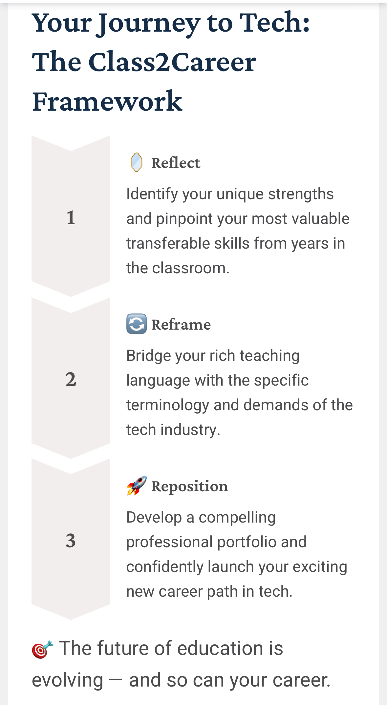

[Home](https://stacynwigwe.github.io/product-experiments/) | 
[🔙 Back to Portfolio](https://stacynwigwe.github.io/portfolio/)
---
# Class2Career: The Tech Pivot Roadmap for Teachers  

## Overview  
**Class2Career** is a digital transition toolkit that helps educators pivot from the classroom into technology careers with confidence and clarity.  
Built from my own experience transitioning from teacher → consultant → mentor → IT Business Analyst, this project guides users through a structured, reflective journey that connects their *teaching expertise* to *tech industry opportunities.*

---
## [Class2Career](https://gamma.app/docs/Class2Career-za23xmbgnh5fee7) 

**Summary:**  
A 3-phase roadmap designed to help teachers pivot into tech by applying product-thinking and systems strategy to their career transitions.  

**Framework Overview:**  
1️ **Reflect** — Identify strengths and pinpoint transferable skills from classroom experience.  

2️ **Reframe** — Translate teaching language into the technical and analytical language of the tech industry.  

3️ **Reposition** — Build a professional portfolio and confidently launch a new career path in tech.  

*The future of education is evolving, and so can your career.*
---

## Problem  
Many teachers want to move into tech but don’t know how to begin.  
They face three common roadblocks:  
- Uncertainty translating classroom experience into tech-aligned skills  
- Overwhelm from generic advice not tailored to educators  
- Lack of a structured plan or roadmap for measurable progress  

**Class2Career** addresses this gap with a system designed *by an educator who’s done it*.

---

## Mission  
Empower teachers to transform their transferable skills into a sustainable tech career: bridging the gap between education and technology through systems thinking, reflection, and intentional career design.  

---

## Solution  
A 3-phase roadmap that mirrors how teachers already think and plan:  

### Phase 1: **Reflect**  
Identify and translate existing skills using a *Skill Translation Matrix.*  
> “Lesson Planning → Sprint Planning”  
> “Student Data → Performance Metrics”  

### Phase 2: **Reframe**  
Bridge educational experience with tech language and roles.  
- Resume and LinkedIn translation templates  
- Learning path recommendations for tech tools (CRM, SQL, BI, Agile)  
- Example: “From Classroom Management to Stakeholder Management”  

### Phase 3: **Reposition**  
Build a tech-ready professional identity.  
- Pivot Portfolio template (turn past projects into case studies)  
- Career/Application Tracker dashboard in Google Sheets  
- 30-60-90 Pivot Plan to measure progress  

---

## Users  
**Primary Users:**  
Educators, instructional leaders, or curriculum specialists exploring career transitions into roles such as:  
- Business Analyst  
- Product or Project Manager  
- Learning Technologist  
- Data Analyst  
- EdTech Implementation Specialist  

---

## MVP Deliverables  

| Component | Description | Output |
|------------|--------------|--------|
| Skill Translator Map | Interactive table linking classroom skills to tech roles | PDF/Google Sheet |
| Pivot Planner Dashboard | Structured tracker for career milestones | Excel/Notion template |
| Resume Reframe Kit | Resume + LinkedIn phrasing templates | Downloadable PDF |
| Class2Career Flow | Visual 3-phase roadmap (Reflect → Reframe → Reposition) | Canva Mockup |

---

## Success Metrics  
- 50% reduction in time-to-first-tech interview  
- +30% increase in educator confidence (via self-assessment feedback)  
- Measure engagement via downloads, shares, and educator testimonials  

---

##  Impact  
*Class2Career* doesn’t just help teachers leave the classroom, it helps them see their skills differently.  
By applying systems thinking to career transitions, educators learn:  
> “You’re not leaving education, you’re expanding it into new systems.”  

---

## Tools Used  
- Canva (design + visual storytelling)  
- Google Sheets (career dashboard templates)  
- Markdown + GitHub (documentation)  
- ChatGPT (collaborative ideation partner)  

---

## Creator  
**Created by:** Stacy Nwigwe  
*Educator turned Analyst, Systems Thinker, and Product Storyteller*  
📍 Sunrise, FL | 🌐 [Portfolio](https://stacynwigwe.github.io/portfolio)  

---
Class2Career is a conceptual project designed to illustrate my approach to product thinking and career transition systems for educators.
