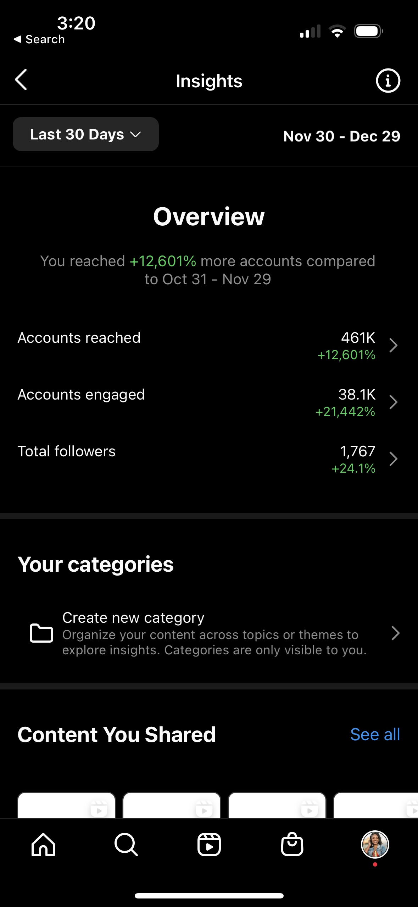
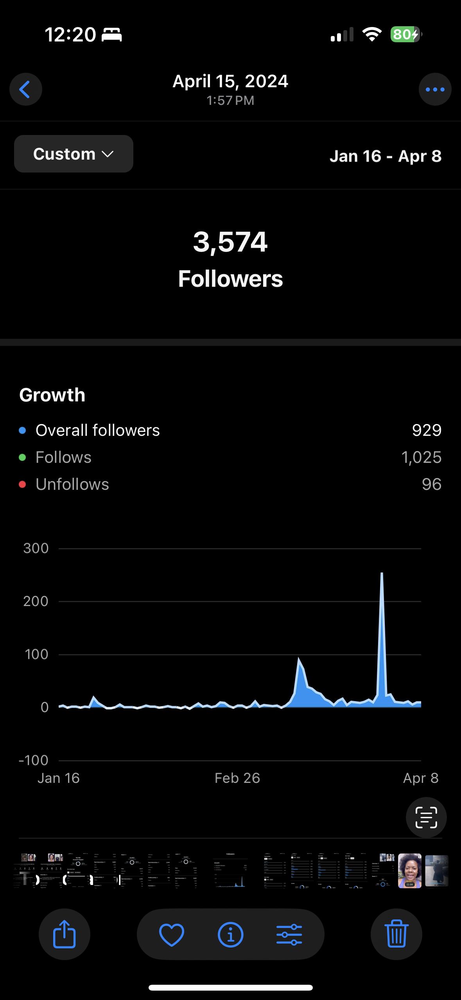

[Home](https://stacynwigwe.github.io/product-experiments/) | 
[🔙 Back to Portfolio](https://stacynwigwe.github.io/portfolio/)
---
# The Poetic Sage
Faith + poetry Instagram platform.

## Overview
A creative side project to test how poetry and faith-based content could be packaged like a product. 

## What I Did
- Created, branded, and shared poetry content with a consistent aesthetic.  
- Grew engagement to 450K+ impressions through organic reach.  
- Collected audience feedback to adapt tone and content.  

## What I Learned
- The importance of consistency in marketing for growth.  
- How to package ideas into “products” that resonate.  
- Gained insight into audience behavior and traction analysis.  

## Visuals

 

 

 
