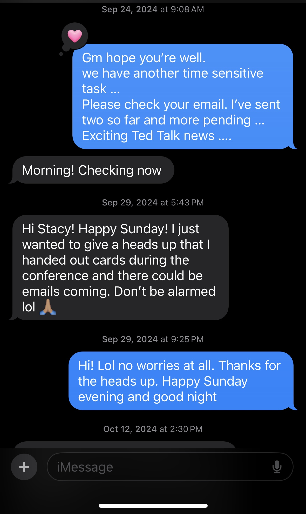
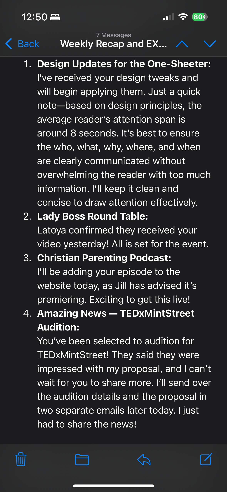

[Home](https://stacynwigwe.github.io/product-experiments/) | 
[🔙 Back to Portfolio](https://stacynwigwe.github.io/portfolio/)
---
# TheVirtualSage
Freelance strategy & business support service.

## Overview
A consulting venture that supported small businesses, non-profits, and thought leaders with systems, operations, and visibility.

## What I Did
- Designed automated workflows for scheduling, proposals, and reporting.  
- Managed client social media and secured high-visibility opportunities (e.g., conferences, podcasts, TED Talk interview).  
- Built performance dashboards and vendor reports that improved business continuity.  

## What I Learned
- Translating client needs into scalable systems.  
- How to deliver measurable ROI in freelance consulting.  
- Value of documenting processes so others could replicate success.  

## Visuals

